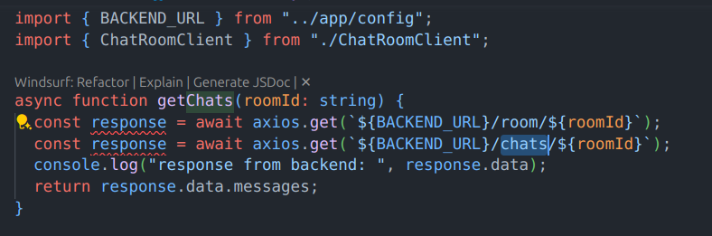

### Error which takes almost 5 hours to debug

# it was nothing but a word error i have to write the chats instead of room ..... was totally fucked up

The Prisma schema defines three models: User, Message, and Comment. The User model represents chat app users, linked to both messages and comments. The Message model stores individual messages, associated with the user who posted it. The Comment model represents comments on messages, linked to both the message and the user who commented. This setup allows for managing user-generated messages and comments in a structured, relational way.

// How to add a functionality of comment by a user in a chat app //

model User {
id Int @id @default(autoincrement())
username String @unique
email String @unique
password String
comments Comment[]
messages Message[]
}

model Message {
id Int @id @default(autoincrement())
content String
createdAt DateTime @default(now())
updatedAt DateTime @updatedAt
userId Int
user User @relation(fields: [userId], references: [id])
comments Comment[]
}

model Comment {
id Int @id @default(autoincrement())
content String
createdAt DateTime @default(now())
updatedAt DateTime @updatedAt
messageId Int
message Message @relation(fields: [messageId], references: [id])
userId Int
user User @relation(fields: [userId], references: [id])
}
